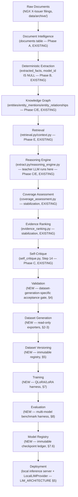
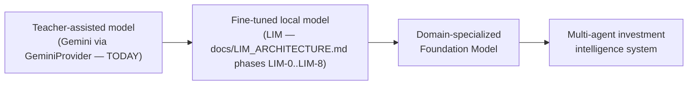

# Fund Alpha — Dataset Generation & Training Specification

**Status: DESIGN ONLY. No training code, no dataset-generation code, and no
change to the AI Intelligence Layer (frozen at
`ai-layer-stable-baseline-2026-07-27`) exist as a result of this document.**
This specification sits *underneath* `docs/LIM_ARCHITECTURE.md` — that
document designed the model/provider/inference layer; this one designs the
data substrate that feeds it and every future Fund Alpha model. Neither
document restates the other's content; they compose. Nothing below
authorizes Phase LIM-0 or any implementation — that gate is unchanged.

---

## 1. Overall architecture

### 1.1 Guiding principle: every stage boundary is a DATA contract, never a CODE contract

This is already how the AI Intelligence Layer is built — `extract.py`
never imports `retrieval.py`; `reasoning_engine.py` never imports
`alpha_engine.py`; nothing in this new data/training track imports anything
from `src/ngxrot/documents/` either. It reads rows from tables whose schema
is the contract. This specification makes that rule explicit and extends
it through every new stage: **a stage's entire interface to its neighbors
is "what tables/files does it read" and "what tables/files does it
produce" — never a shared in-memory object, never a direct function call
across the boundary.** This is what makes every stage independently
testable, independently re-runnable, and safe to modify without touching
its neighbors.

### 1.2 The full pipeline, stage by stage



Everything through **Self-Critique (I)** is the frozen AI Intelligence
Layer, unchanged, doing exactly what it already does in production —
answering real reasoning questions about real companies. **Validation
onward (J-P) is entirely new** and reads the output of I as historical
data, the same way `pilot_summary.py` already reads `extracted_facts`/
`self_critique_reviews` today without being part of the pipeline that
produced them.

### 1.3 Why Validation (J) is a distinct stage from Self-Critique (I)

Self-Critique (I) decides whether a claim is trustworthy enough to *exist
in the database at all* (its output: `unvalidated_ai_interpretation` vs
`blocked_by_self_critique`). Validation (J) asks a different, narrower
question: **is this specific row good enough to teach the next model**,
which is a stricter and differently-shaped bar. A row can be a perfectly
legitimate, correctly-`blocked_by_self_critique` database entry (the
CILEASING case from the 2026-07-27 stabilization run — correctly blocked on
`insufficient_information`) and *still* be exactly the kind of row Dataset
Generation wants — as a **negative training example** for the Self-Critique
dataset, not as a positive Financial-Reasoning example. Conflating these
two gates would either (a) only ever train on the easy, already-approved
rows and never teach the model what a real failure looks like, or (b)
pollute the reasoning pipeline's own governance with dataset-specific
logic it has no reason to carry. Keeping them separate is a deliberate,
justified design decision, not an oversight.

### 1.4 What does NOT change

No table in `schema/schema.sql` gains a column for dataset generation.
Every stage from Validation onward is **read-only** against the existing
schema — it materializes its own new artifacts (JSONL files, a new
registry database, checkpoints) entirely outside the AI Intelligence
Layer's storage. This mirrors the exact boundary `docs/LIM_ARCHITECTURE.md`
§1.2 already established for `src/ngxrot/lim/`.

---

## 2. Dataset types

Every dataset instantiates the single canonical schema in §3 — what
differs per type is which fields are populated and from which source rows.
"Maturity today" is reported honestly against the real database as of the
2026-07-27 stabilization validation, not as an aspiration.

| # | Dataset | Primary source (existing schema) | Maturity today | Task shape |
|---|---|---|---|---|
| 1 | **Financial reasoning** | `extracted_facts`+`causal_chain_steps`+`impact_assessments` (`model_id IS NOT NULL`) | Thin (18 real LLM-sourced facts) but growing with every real document | document passage → structured extraction + causal chain |
| 2 | **Extraction** | `extracted_facts` (both `model_id IS NULL` deterministic and LLM rows) | **Most mature** — 143 deterministic Phase B facts at extraction_confidence=1.0 | passage → typed fact (fact_type, numeric_value, dates) |
| 3 | **Entity recognition** | `entities`+`entity_mentions` | Moderate (37 entities on record) | passage → named entity + type |
| 4 | **Corporate actions** | `extracted_facts` where `fact_type` in the capital/governance taxonomy leaves (`configs/fact_taxonomy.toml`) | Mature — same 143-row Phase B set, the platform's most validated deterministic dataset | filing → dividend/bonus/rights/agm/etc. structured record |
| 5 | **Event understanding** | `documents.event_date`/`.news_classification` (Phase C identification columns) + `events` table (quant side, 93 evidence-grade events) | Thin — Phase C identification columns are populated but not yet the primary source of a dedicated dataset; deliberately does NOT duplicate `events`, which serves the quant engine's own event-study machinery | filing → event type + date + scope |
| 6 | **Contradiction detection** | `investment_implications.contradicts_implication_id`/`.corroborates_implication_id` + `evidence_ranking.assess_implication_conflict` | Thin but real — 1 real conflict on record (TOTAL), 0 real trust/confidence disagreements yet (a constructed disagreement exists only in `test_reasoning_pipeline.py`'s synthetic fixture) | two implications + evidence tiers → correct preference + rationale |
| 7 | **Self-critique** | `self_critique_reviews` (all findings, including `fail`/`concern`) | Moderate — 136 real critique rows, 8 real `fail` findings, 71 real `concern` findings | draft claim + critique question → finding + explanation |
| 8 | **Investment decision support** | `investment_implications`'s direction/magnitude/duration_bucket/action_recommendation/bull-bear-base fields | Thin (18 rows) | facts + context → decision-support fields, framed as **research flags, never advice** (§2.1) |
| 9 | **Portfolio reasoning** | `investment_implications.portfolio_sizing_note`/`.risk_profile_direction` | Very thin, and deliberately scope-limited (§2.2) | facts → descriptive portfolio-relevant commentary, **never an allocation/weight** |
| 10 | **Retrieval** | `retrieval.py` query/result pairs | Bootstrap — retrieval queries exist in code but haven't been logged as training pairs before this spec | (ticker/question) → which documents/facts are relevant |
| 11 | **RAG (multi-fact synthesis)** | `context.py`'s `ReasoningContext` + `reasoning_engine.ReasoningResult` | Thin — requires synthesizing across multiple already-retrieved facts, a harder skill than single-document extraction | (query, retrieved context set) → synthesized grounded answer |
| 12 | **Citation grounding** | `evidence` rows + `extracted_facts.grounding_check`, including real failures (fact_id 147, 148) | Moderate — 192 real evidence rows, 2 confirmed real grounding failures as negatives | (claim, candidate quote) → grounded / not-grounded |
| 13 | **Hallucination detection** | Rejected-partition rows from the Validation stage (§4) — a superset of citation-grounding negatives, includes contradiction-unaware and low-coverage rejects too | Bootstrap — depends on the Validation stage existing first | (claim, context) → hallucinated / supported, with the specific failure mode named |
| 14 | **Confidence estimation (calibration)** | `investment_implications.confidence` vs. downstream outcome signals (self-critique survival, later corroboration) | Bootstrap — needs enough historical implications to observe "did later evidence agree" | (claim + stated confidence) → calibration label |
| 15 | **Coverage assessment** | `coverage_assessment.CoverageAssessment` (all 12 real tickers with implications today) | Moderate — every real ticker has a computed assessment (scores 0.5-0.6 uniformly, per stabilization validation) | (ticker, as_of) → coverage dimensions + score + ceiling + reasons |
| 16 | **Evidence ranking** | `evidence_ranking.rank_evidence_for_fact`/`.assess_implication_conflict` | Moderate — 79 tier-1, 2 tier-4 real evidence rows observed today | (evidence set) → ranked order + trust tier + rationale |
| 17 | **Knowledge graph completion** | `entity_relationships` | **Bootstrap, honestly near-empty** — 0 rows on real data as of the 2026-07-27 validation (TD11/TD12/TD14 already document why); this dataset cannot be meaningfully populated until Phase F's propagation and entity-resolution coverage mature further | (entity, partial relation) → completed relation + evidence |

### 2.1 Investment Decision Support — mandatory framing constraint

Every label in this dataset must be phrased as *what a disciplined analyst
would flag for further research*, never as a recommendation to act. This
is not a stylistic preference — it is the same non-negotiable rule that
already governs `investment_implications.action_recommendation`'s fixed
vocabulary (`no_action`/`watchlist`/`research_task`/... — notably, no
`buy`/`sell` value exists in `vocab.ACTION_RECOMMENDATIONS` today) and
`docs/AI_INTELLIGENCE_LAYER_ARCHITECTURE.md`'s hard boundary that only a
fully pre-registered, gauntlet-passed hypothesis may ever become
portfolio-facing. A model trained on this dataset inherits that boundary
in its *training labels*, not just in a system prompt it could ignore.

### 2.2 Portfolio Reasoning — deliberately scope-limited

Portfolio Construction remains gated platform-wide (needs ≥2 independent
validated factors; only H-011/Size exists today). This dataset must never
teach a model to propose a position size, weight, or allocation. It trains
only on the existing `portfolio_sizing_note`/`risk_profile_direction`
descriptive fields — hedged, evidence-cited commentary about how a fact
*might* bear on portfolio considerations, in the same register the
platform's own analysts already write in. If this constraint cannot be
cleanly enforced by curation alone, this dataset type should be deferred
entirely rather than risk teaching the wrong lesson — flagged as an open
decision in §11 rather than resolved by fiat here.

---

## 3. Training example schema

One canonical shape, used by every dataset type in §2 (task-specific
content lives inside the generic fields, never as bespoke per-type schema
variants — this is what keeps the audit framework in §6 and the training
harness in §7 dataset-type-agnostic).

```json
{
  "unique_id": "fr-2026.07-000142",
  "dataset_version": "financial_reasoning-v1.3.0",
  "task": "financial_reasoning_extraction",
  "instruction": "Identify every material fact in this filing and assess its impact...",
  "context": {
    "ticker": "CILEASING",
    "as_of": "2026-05-18",
    "document_excerpt": "...verbatim passage the model must reason over..."
  },
  "retrieved_documents": [11298],
  "retrieved_facts": [161],
  "reasoning_context": {
    "coverage_score": 0.6,
    "prior_implications": [12, 15],
    "entity_relationships": []
  },
  "expected_output": {
    "fact_type": "dividend",
    "direction": "neutral",
    "magnitude": "small",
    "causal_chain": ["...", "..."],
    "impact_assessments": { "revenue": {"direction": "unknown", "explanation": "..."} }
  },
  "citations": [{"evidence_id": 210, "doc_id": 11298, "quoted_text": "...", "grounding_check": "passed"}],
  "evidence_tier": 1,
  "confidence": 0.3,
  "coverage_score": 0.6,
  "reasoning_chain": [{"step_order": 0, "statement": "...", "inferred": false}],
  "self_critique": {"findings": {"insufficient_information": "fail"}, "status": "blocked_by_self_critique"},
  "contradiction_analysis": null,
  "acceptance_status": "rejected",
  "rejection_reason": "self_critique_fail:insufficient_information",
  "quality_score": 0.12,
  "created_at": "2026-07-27T00:00:00Z",
  "source_documents": [11298]
}
```

| Field | Why it exists |
|---|---|
| `unique_id` | Stable identifier surviving across dataset versions — the anchor for lineage (§5) and the cross-version leakage check (§9). Never reused across versions, even if regenerated from the same source row. |
| `dataset_version` | Every example is permanently stamped with the exact immutable version that produced it — makes "which version was this trained on" a property of the example itself, not just the file it lives in. |
| `task` | Names which of the 17 §2 datasets this example belongs to — lets one physical JSONL store multiple task types if ever convenient, without ambiguity. |
| `instruction` | The literal prompt instruction the model is trained to follow — kept explicit (not implied by `task` alone) so prompt-wording changes are visible in the data itself, matching `prompts.py`'s own `DRAFT_PROMPT_VERSION`/`CRITIQUE_PROMPT_VERSION` versioning discipline. |
| `context` | The minimum situational information (ticker, as_of, the actual passage) — kept separate from `reasoning_context` deliberately: `context` is "what the document says," `reasoning_context` is "what the platform already knows about this company." |
| `retrieved_documents` / `retrieved_facts` | Explicit IDs of every upstream row the example depends on — this is what makes the RAG/Retrieval dataset types (§2, #10-11) trainable at all: the model must learn to work from a *given* retrieval set, not memorize documents. Also the backbone of lineage (§5.3). |
| `reasoning_context` | A compact snapshot of `ReasoningContext`'s non-document fields (coverage, prior implications, entity relationships) — teaches the model to condition on platform state, not just raw text. |
| `expected_output` | The target the model is trained to produce — shape varies by `task`, always matching the exact schema the real pipeline already writes to `extracted_facts`/`investment_implications`, so a trained model's output is drop-in compatible with the existing parsing/validation code (`extract.py`'s enum-safety and grounding checks apply to LIM's output identically). |
| `citations` | Every evidence row backing `expected_output`, with its own `grounding_check` status carried through — this is the field the Citation-grounding and Hallucination-detection datasets are built from directly. |
| `evidence_tier` | The `evidence_ranking.py` trust tier (1-4) of the *best* evidence backing this example — lets training and audit both preferentially weight/inspect tier-1 examples, and lets rejected/low-tier examples be explicitly retained as negatives rather than silently dropped. |
| `confidence` | The teacher's own stated confidence at the time (`investment_implications.confidence` or `extracted_facts.extraction_confidence`) — the raw input to the Confidence-estimation/calibration dataset (#14) and to calibration evaluation (§8). |
| `coverage_score` | The ticker's `CoverageAssessment.coverage_score` at generation time — lets the audit framework (§6) flag examples drawn from thin-coverage contexts, and lets a future curriculum stage choose to under-weight them. |
| `reasoning_chain` | The full `causal_chain_steps` shape (statement + inferred flag + evidence_id) — the direct training signal for "why," not just "what." |
| `self_critique` | The full `self_critique_reviews` outcome for this example's implication, if one exists — the entire basis of the Self-Critique dataset (#7) and a primary acceptance-pipeline input (§4). |
| `contradiction_analysis` | The `evidence_ranking.assess_implication_conflict` result, if this example's implication contradicts/corroborates a prior one — null when not applicable, never fabricated. |
| `acceptance_status` | `accepted` / `rejected` — see §4. Present on every example, including accepted ones, so a single field partitions the whole corpus without needing separate files to know the answer. |
| `rejection_reason` | Populated only when `acceptance_status="rejected"` — a short, structured code (e.g. `grounding_failed`, `self_critique_fail:<question>`, `contradicts_higher_tier_evidence`, `coverage_below_floor`) naming *exactly* why, per the "never silently repair, always record why" requirement (§4). |
| `quality_score` | The deterministic, disclosed composite score (§4.4) that acceptance was thresholded on — kept even on rejected examples, since "how far below the bar" is itself useful signal for future threshold tuning. |
| `created_at` | Export timestamp — distinct from the underlying fact's `filing_date`/`generated_at`; needed to reconstruct exactly what the exporter saw at export time, independent of later restatements to the source data. |
| `source_documents` | The literal `doc_id`(s) this example is ultimately traceable to — the coarsest-grained lineage field, kept even when `retrieved_documents` is more specific, since some dataset types (e.g. Portfolio Reasoning) may reference a document without a formal retrieval step. |

---

## 4. Teacher model pipeline (acceptance pipeline)

### 4.1 The core principle, restated precisely

**The teacher model (today: Gemini; eventually, potentially, an earlier
LIM checkpoint bootstrapping a later one) proposes. It never gets to
decide it is correct.** This is not a new principle for this platform — it
is the exact same principle that already produced the Self-Critique gate,
`grounding.py`'s mechanical (never self-reported) checks, and the
"mechanical check overrides the model's own verdict" rule in
`self_critique.py`'s `_escalate()`. Section 4 is that same principle,
applied one layer up: governing whether an already-governed row is good
enough to *teach the next model*, not just good enough to *exist in the
database*.

### 4.2 The pipeline

```mermaid
flowchart LR
    GT["Ground Truth\n(Phase B deterministic facts\nOR human gold review)"]
    TG["Teacher Generation\n(extract.py + self_critique.py —\nALREADY-RUN production calls,\nnever re-run just for dataset purposes)"]
    GV["Grounding Verification\n(fresh live re-check, not the\nstored flag — grounding.py, reused)"]
    CV["Citation Verification\n(evidence_id resolves,\ndoc_id matches — reused)"]
    CA["Coverage Assessment\n(coverage_assessment.py, reused)"]
    ER["Evidence Ranking\n(evidence_ranking.py, reused)"]
    SC["Self-Critique\n(self_critique_reviews, reused)"]
    CD["Contradiction Detection\n(assess_implication_conflict, reused)"]
    QS["Quality Scoring\n(NEW — deterministic formula, §4.4)"]
    AR["Accept / Reject\n(NEW — threshold + hard rules, §4.5)"]

    GT --> TG --> GV --> CV --> CA --> ER --> SC --> CD --> QS --> AR
    AR -->|accepted| ACC["Accepted partition"]
    AR -->|rejected| REJ["Rejected partition\n(rejection_reason always recorded)"]
```



Every stage from Grounding Verification through Contradiction Detection
**reuses an existing module directly** — none of it is reimplemented for
dataset purposes. Teacher Generation is explicitly *not* a dataset
-generation-triggered call: it is the platform's own real, already-running
reasoning traffic. This avoids the wasteful (and quality-diluting) pattern
of generating synthetic examples on demand; every dataset candidate is
something the platform already needed to compute for its own operational
reasons.

### 4.3 Rejected examples are never silently repaired

If a proposed example fails any check, it is **not** corrected, patched, or
re-prompted-and-retried into passing. It is recorded, with its exact
`rejection_reason`, in the rejected partition. This is the same discipline
`extract.py` already applies to a single ungrounded quote (forced to
`extraction_confidence=0.0`, never guessed into something plausible) —
applied here at the level of a whole training example. A rejected example
is frequently *more* valuable than an accepted one: it is exactly the
negative/hard-case material the Self-Critique, Contradiction-Detection, and
Hallucination-Detection datasets (§2, #6/#7/#13) are built from. Rejection
is a classification, not a deletion.

### 4.4 Quality scoring — a deterministic, disclosed formula

`quality_score` is never a learned or opaque number. It is computed from
already-known signals with disclosed, owner-adjustable weights — the same
posture as `vocab.CONFIDENCE_DISCOUNT_PER_CONCERN`/
`COVERAGE_CONFIDENCE_CEILING_BANDS`. **Hard exclusions apply before any
weighting** (mirroring `extract.py`'s "grounding failure forces
confidence to exactly 0.0, not a low-weighted average"):

- `grounding_check != 'passed'` on the example's primary citation → `quality_score = 0` (hard).
- Implication `contradicts_implication_id` set AND the contradicting prior
  has a strictly better (lower-numbered) evidence tier AND was not itself
  superseded → `quality_score = 0` (hard) — never let a model learn a claim
  a higher-trust source already disputes.
- Otherwise, a weighted combination of: self-critique severity (pass=1.0,
  concern=0.6, fail=0.0 per question, averaged), evidence tier (tier 1=1.0
  … tier 4=0.25), coverage_score (as computed), citation-integrity pass/fail
  (binary). Exact weights are a config value (`configs/dataset_quality_
  weights.toml`, mirroring `configs/coverage_thresholds.toml`'s existing
  pattern), owner-adjustable, disclosed in every dataset version's
  changelog (§5) when changed.

### 4.5 Accept / reject

`accepted` requires: no hard exclusion triggered, AND `quality_score` at or
above the dataset-type-specific threshold (configurable — a Self-Critique
*negative* example, for instance, is deliberately accepted at a much lower
`quality_score` than a Financial-Reasoning *positive* example would need,
since its value lies in exemplifying a genuine failure, not in scoring
well). Both partitions are retained permanently; neither is ever
discarded.

---

## 5. Dataset versioning

### 5.1 Modeled on an already-proven pattern

The quant engine's `data/registry.sqlite` hypothesis ledger is already
immutable and append-only, enforced by SQL triggers blocking `UPDATE`/
`DELETE`. Dataset versioning reuses that exact mechanism and philosophy,
in a **new, separate** registry (never the same database or table as the
hypothesis ledger — different domain, not to be conflated, per
`docs/LIM_ARCHITECTURE.md` §3.5's existing decision). Proposed:
`lim_training/dataset_registry.sqlite`, one row per dataset version, same
trigger-enforced immutability.

### 5.2 What a version is

A `dataset_version` is an immutable, content-addressed identifier: a
semantic string (e.g. `financial_reasoning-v1.3.0`) *plus* a SHA-256 hash
of the full exported JSONL content, so the identifier is tamper-evident —
two files claiming the same version string must be byte-identical, or
something is wrong and must be investigated, never silently accepted.

Recorded per version (immutable once written):

| Field | Purpose |
|---|---|
| `version` | The semantic string |
| `content_hash` | SHA-256 of the full export — tamper-evidence |
| `dataset_type` | Which of the §2 17 types |
| `generated_at` | Wall-clock export time |
| `source_as_of` | The PIT vintage of the underlying tables this export read — mirrors the quant engine's `vintage_date`/preregistration-pinning discipline exactly; a dataset version is pinned to a moment, the same way a hypothesis prereg is |
| `export_script_commit` | Git commit hash of the exporter code that produced it |
| `row_counts` | Accepted/rejected counts, by `rejection_reason` |
| `teacher_model_ids` | Every distinct `model_id` contributing rows (e.g. `["gemini-3.6-flash"]` today) |
| `changelog` | Free-text, human-authored: what changed vs. the prior version and why |
| `parent_version` | Null for a full rebuild; set for an incremental version built on top of a prior one (§5.4) |

### 5.3 Lineage

Every example's `unique_id` (§3) plus `source_documents`/`retrieved_facts`
gives full row-level lineage in both directions without any new column on
the existing schema: given a training example, its exact source DB rows
are named directly; given a DB row (e.g. `fact_id=161`), every dataset
version that ever included it is discoverable by searching exported JSONL
for that ID — a reverse index computable entirely from the exported
artifacts, never requiring the live AI Intelligence Layer schema to carry
a back-reference to a training system it has no business knowing about
(preserving the boundary in §1.4).

### 5.4 Immutability, changelogs, rollback

Once a version is registered, its content never changes — a correction is
always a **new** version with an incremented number and a changelog entry
explaining the fix, exactly like the platform's existing restatement
discipline for `events`/prices (`event_pipeline.py`'s append-only
conflict-preservation, never overwritten). **Rollback is therefore trivial
and requires no special mechanism**: a training run's config simply
references an older `version` string. This is the entire reason
immutability was chosen over a mutable scheme — rollback-by-deletion would
need its own undo logic; rollback-by-reference needs nothing extra.

Two supported generation modes, both immutable once cut:
- **Full rebuild**: re-runs the whole §4 pipeline over the entire current
  table state, `parent_version = null`.
- **Incremental**: runs §4 only over rows newer than `parent_version`'s
  `source_as_of`, producing a smaller delta version that references its
  parent — the expected mode for continuous learning (§9).

### 5.5 Reproducibility

Given a `dataset_version`'s recorded `source_as_of` and
`export_script_commit`, regenerating it should be byte-identical **if**
the underlying source rows have not been restated since. If they *have*
been restated (the platform's bitemporal design explicitly allows this),
regeneration must detect and report the divergence honestly — "this
version no longer reproduces exactly because source row X was restated on
date Y" — never silently accepted as if nothing changed, matching the
existing PIT/restatement disclosure discipline throughout `db.py`.

---

## 6. Dataset audit framework

### 6.1 Same enforcement pattern as the quant engine's coverage gate

The quant engine already refuses to run a gated config when its coverage
gate fails, and re-evaluates that gate on every ingest. This section is
the identical mechanism, ported to a new domain: **a fixed audit runs
before any training run is permitted to start against a given
`dataset_version`, and training is refused — not merely warned — if a
configured threshold is breached.** Thresholds live in
`configs/dataset_quality_thresholds.toml`, mirroring
`configs/coverage_thresholds.toml`'s existing naming and philosophy
exactly.

### 6.2 Metrics computed, and what they show on the real data today

| Metric | Method | What it shows TODAY (real data, honestly reported) |
|---|---|---|
| Duplicate rate | Exact + near-duplicate detection across `unique_id`/text content | Not yet measured — no dataset has been exported yet under this spec |
| Contradiction rate | Fraction of examples whose implication has an unresolved `contradicts_implication_id` against a not-lower evidence tier | 1 known real conflict (TOTAL) out of 18 real implications |
| Citation integrity | Reused from `validate_stabilization_e2e.py`'s `_citation_integrity` | 100% (18/18) as of 2026-07-27 |
| Grounding integrity | Reused fresh live re-verification, never the stored flag alone | 100% (18/18) as of 2026-07-27 |
| Company (ticker) distribution | Histogram over `context.ticker` | Real skew exists today — TOTAL has 4 implications, most other tickers have 1; a real concentration risk to flag, not hypothetical |
| Sector distribution | Histogram over `securities.sector_ngx` | **Currently a non-functional metric** — `sector_ngx` is 0/320 populated platform-wide (a pre-existing, disclosed gap, not new); this audit line reports "not computable" honestly rather than a fabricated even distribution |
| Class balance (per dataset type) | e.g. self-critique finding distribution | Real numbers today: 65 pass / 71 concern / 8 fail (144 = 18×8) |
| Temporal balance | Histogram over `filing_date` | Not yet measured at export time — flagged as a real risk given the platform's document corpus spans 2014-2026 unevenly |
| Event-type / fact-type balance | Histogram over `fact_type`/`doc_type` | Real skew today — extraction so far is dividend-heavy (Phase B/C's actual corpus), a known, disclosed imbalance from `reports/phase_c_completion.md` onward |
| Confidence distribution | Histogram over `confidence`/`extraction_confidence` | Bounded at 0.3 today (`UNREVIEWED_LLM_CONFIDENCE_FLOOR`) for every unreviewed LLM row — a real ceiling effect the audit must report, not smooth over |
| Coverage-score distribution | Histogram over `coverage_score` | 0.5-0.6 uniformly across all 12 real tickers with implications, per the 2026-07-27 validation |
| Evidence-tier distribution | Histogram over `evidence_tier` | 79 tier-1, 2 tier-4, 0 tier-2/3 (tiers 2-3 remain unreachable until news/regulatory sources are ingested — an honest structural zero, not a bug) |
| Reasoning-length distribution | Token/step count of `reasoning_chain` per example | Not yet measured; flags degenerate too-short or runaway too-long chains once measured |
| Acceptance / rejection rate | From §4's pipeline output | Not yet measured — depends on the Validation stage (§1.3) actually running |

### 6.3 Enforcement

The audit produces a dual Markdown+JSON report (matching
`pilot_summary.py`'s existing dual-output convention exactly), stored
alongside the dataset version's own artifacts
(`lim_training/datasets/<name>/<version>/audit_report.{md,json}`) rather
than a separate global reports directory — co-located with what it
describes. A training run's launcher must read this report and refuse to
start if any configured threshold is breached, exactly mirroring
`runner.run_resolved`'s existing refusal to run a gated quant config when
the coverage gate fails.

---

## 7. Training architecture (design only — no implementation)

### 7.1 Adapter method and quantization as orthogonal, config-driven axes

QLoRA (4-bit quantized frozen base + LoRA adapter) is the default because
of the current hardware (`docs/LIM_ARCHITECTURE.md` §2.2-2.3). The
harness must treat "quantize: true/false" and "adapter: lora" as two
independent config flags, not a hardcoded combination — so moving to
larger hardware later (§2.4 of that document) is a config change
(`quantize: false` → plain bf16 LoRA, or eventually full fine-tuning),
never a rewrite of the training harness itself.

### 7.2 Unsloth as a swappable acceleration backend

Unsloth is the recommended backend for its VRAM/speed advantages on
consumer GPUs (justified with real 2026 figures in
`docs/LIM_ARCHITECTURE.md` §2.2). It sits behind a small internal
abstraction (the harness calls a `TrainingBackend` interface, not Unsloth
directly) for the same reason the whole platform already trusts the
`LLMProvider` abstraction — if a future Qwen release's Unsloth support
lags, or a better-suited library emerges, swapping backends is a new class
registration, not a rewrite.

### 7.3 Checkpointing and RNG-state discipline

A checkpoint artifact is: adapter weights + optimizer state + **RNG
state** (all of Python/NumPy/PyTorch/CUDA generator state). The platform's
quant engine already enforces "unseeded stochastic runs refused; reruns
verified bit-identical" as an institutional safeguard — training carries
the identical discipline forward: every run records its seed(s), and
**resuming from a checkpoint must restore RNG state, not just model
weights** — otherwise a "resumed" run silently diverges from what an
uninterrupted run would have produced, a real and easy-to-miss correctness
bug class in ML training that this design explicitly guards against by
naming it as a requirement now, before any training code exists.

### 7.4 Resumable training — same two-layer discipline as document processing

A `training_run_status` table is a **fast signal only**, cross-checked
against the real checkpoint files on disk before ever being trusted for a
skip/resume decision — the identical pattern `pipeline_status.py` already
proved out for document processing (`should_skip()`/`resume_point()` never
trust the status row alone). This is not a new invention; it is the same
mechanism, restated for a new domain.

### 7.5 Mixed precision

**bf16, not fp16.** The RTX 3050 is Ampere-class hardware with native bf16
support, and bf16 avoids fp16's overflow/underflow instability during
quantized training — a hardware-grounded recommendation, not generic
advice.

### 7.6 Experiment tracking and hyperparameter versioning — reconciling two requirements

`docs/LIM_ARCHITECTURE.md` §3.5 recommended a **local-only** lightweight
registry over W&B/MLflow specifically to avoid a new external dependency.
This document's explicit requirement for TensorBoard/W&B compatibility
does not actually conflict with that, once designed correctly: the
lightweight SQLite/JSONL registry remains the **system of record**
(immutable, append-only, local, no account/network needed), while a
**separate, optional emitter** additionally writes standard TensorBoard
event-log files (a local file format requiring nothing external) and/or
W&B **offline-mode** logs (no account, no network, syncable later only if
ever desired) purely for visualization convenience. TensorBoard/W&B are
viewers of the same underlying metrics, never the source of truth — this
resolves the apparent tension cleanly and is the corrected, more complete
position versus the prior document's shorter treatment of the same
question.

Every run's full hyperparameter set (LoRA rank/alpha/dropout, learning
rate, batch size, gradient accumulation, quantization config, exact base
model + revision, `dataset_version`) is recorded immutably alongside the
run in the same registry — a formalization of the "sidecar JSON per
checkpoint" already described in `docs/LIM_ARCHITECTURE.md` §3.5, now
elevated to a first-class, disclosed schema since this document calls it
out explicitly.

Also recorded in the same registry, as its own append-only table: the
**Model Registry** (§1.2's final new stage before Deployment) — one
immutable row per exported, mergeable checkpoint (run_id, base_model,
final `dataset_version` lineage, full eval-harness results from §8,
GGUF export hash, promotion status). A model is only ever promoted to
"available for shadow-mode evaluation" or "available as a selectable
provider" by an explicit, disclosed status change on its own row — never
inferred from training having merely finished.

### 7.7 Automatic evaluation and automatic checkpoint selection

Two tiers, distinguished by cost, matching the distinction already implicit
in `docs/LIM_ARCHITECTURE.md` §3.5: **cheap, frequent** (held-out split
loss/perplexity, every N steps) vs. **expensive, periodic** (the full §8
harness, run through real local inference, once per curriculum stage).

Checkpoint selection is a **deterministic, disclosed rule**, never "lowest
loss" alone (a checkpoint can overfit narrowly on loss while regressing on
the metrics that actually matter): the selected checkpoint per stage is
the one with the lowest held-out loss **among checkpoints whose full-
harness grounding/citation-accuracy figures are within an owner-configured
tolerance of the current best** — loss picks among qualifying candidates,
domain metrics gate which candidates qualify at all.

---

## 8. Evaluation framework

Extends `docs/LIM_ARCHITECTURE.md` §6 (which already covers hallucination
rate, grounding accuracy, citation accuracy, financial reasoning quality,
self-critique effectiveness, investment usefulness, latency/GPU/
throughput — not restated here). This document adds:

### 8.1 Contradiction detection (new metric)

Held-out real conflict cases (today: the TOTAL implication pair from the
2026-07-27 validation, growing as more real conflicts accumulate) are
replayed against the model under evaluation; its own trust-tier-aware
judgment is compared against the mechanically-computed correct answer
from `evidence_ranking.assess_implication_conflict` — a genuine regression
target, not a synthetic one.

### 8.2 Calibration (new metric)

Bucket the model's stated `confidence` values and check empirical
correctness per bucket (a standard reliability-diagram/Brier-score
approach) — directly evaluates the Confidence-Estimation dataset (§2, #14)
and answers a question the existing pipeline has never had to ask of
itself, since Gemini's `confidence` today is capped by a fixed engineering
floor (`UNREVIEWED_LLM_CONFIDENCE_FLOOR=0.3`) rather than empirically
earned — the honest baseline for this metric today is "not yet
measurable," disclosed rather than assumed good.

### 8.3 Multi-model comparison support

The evaluation harness takes **any `LLMProvider`** as input — `MockProvider`,
`GeminiProvider`, `LocalLIMProvider`, or any registered LIM checkpoint —
and produces the identical metrics table for each, side by side. This
reuses the exact abstraction the platform already trusts (§1.1's guiding
principle applied to models, not just pipeline stages) and mirrors the
quant engine's own `ic_report.py` pattern of generating a comparison memo
across candidate configurations — here, across candidate models instead of
candidate hypotheses.

---

## 9. Continuous learning

### 9.1 New data creates a new version; nothing is overwritten

Every new document the teacher (or, later, LIM in shadow mode) processes
is a candidate for a **future** dataset version. A periodic (or on-demand)
job re-runs §4's pipeline over every row newer than the current version's
`source_as_of`, producing a **proposed incremental version**
(`parent_version` set, §5.4) — never auto-released. The same §6 audit gate
applies before it can be tagged as an official version and before any
training run may reference it, mirroring the quant engine's own "the gate
re-evaluates on every ingest but never silently changes a frozen prereg's
pinned vintage" rule exactly.

### 9.2 Human review feedback

Analyst corrections (`docs/LIM_ARCHITECTURE.md` §3.3's gold set) are
appended as new, separately-versioned gold batches — never edited in
place into an existing gold file. A correction to a past example is a new
example superseding it in the *next* gold version, not a mutation of the
version that already shipped.

### 9.3 Non-contamination check (new, concrete mechanism)

Before any new dataset version is accepted for training use, its training
partition's `unique_id`/`source_documents` set is diffed against **every**
earlier version's held-out evaluation/gold partition. Any overlap is a
hard failure — those rows must be excluded from the new version's training
partition before it can be used, never silently allowed to leak. This is
the concrete mechanism that makes "training datasets remain immutable
after release, and continuous learning never contaminates them" an
enforced rule rather than a stated intention.

---

## 10. Long-term vision



**Teacher-assisted → Fine-tuned local (LIM):** fully designed already in
`docs/LIM_ARCHITECTURE.md` — a provider swap, zero pipeline redesign.

**Fine-tuned local → Domain-specialized Foundation Model:** once enough
continuous-learning cycles (§9) accumulate a large, high-quality, versioned
corpus across all 17 dataset types, the next step — domain-adaptive
continued pretraining on NGX filing text before SFT, and/or moving up
Qwen3's own size ladder (4B→8B→14B→32B, `docs/LIM_ARCHITECTURE.md` §2.4) —
requires **no redesign of anything in this document**: the dataset
architecture, versioning, audit framework, training harness, and
evaluation framework are all already model-size- and stage-agnostic (they
operate on JSONL examples and an `LLMProvider`-shaped interface, never on
architecture internals). Scaling this stage is a config and compute change.

**Domain-specialized Foundation Model → Multi-agent investment
intelligence system:** the curriculum stages in `docs/LIM_ARCHITECTURE.md`
§3.4 (extraction, grounding, causal reasoning, self-critique, gold-polish)
are already, in effect, task-specialized adapters trained from one shared
base. The multi-agent stage generalizes this exact pattern —
`docs/AI_INTELLIGENCE_LAYER_ARCHITECTURE.md`'s four named reasoning
engines (Financial/News/Macro/Industry) plus a dedicated Self-Critique
role each become their own fine-tuned adapter of the same base checkpoint,
orchestrated by a generalized version of `reasoning_engine.py`'s existing
orchestration shape (load context → dispatch to the right specialist(s) →
aggregate already-governed output) rather than a new coordinator built from
scratch. Nothing about this stage requires abandoning the provider
abstraction, the dataset architecture, or the evidence-grade discipline
established across every phase to date — it is more of the same pattern,
applied at maturity, not a different architecture.

---

## 11. Open decisions flagged for the owner

1. Whether the Portfolio Reasoning dataset (§2.2) should be built at all
   in its scope-limited form, or deferred entirely until Portfolio
   Construction itself is unblocked (≥2 validated factors) — a real
   judgment call this document does not resolve.
2. Exact `quality_score` weights and per-dataset-type acceptance
   thresholds (§4.4-4.5) — proposed as config, not fixed, deliberately.
3. Whether TensorBoard-format or W&B-offline-format emission (§7.6), or
   both, or neither beyond the core local registry, is worth the marginal
   engineering cost — a genuine trade-off, not resolved here.
4. Cadence of the continuous-learning incremental-version job (§9.1) —
   nightly, weekly, or purely on-demand — left to owner preference and
   real corpus growth rate once observed.
5. Whether Knowledge-Graph-Completion (§2, #17) should simply be deferred
   as a dataset type until `entity_relationships` has meaningfully more
   than zero real rows, rather than specified now against an empty table.

## 12. Restated hard boundaries

- No table in `schema/schema.sql` changes. Every new stage is read-only
  against the existing AI Intelligence Layer.
- No code exists as a result of this document; no training has occurred.
- `src/ngxrot/documents/` is untouched, per the frozen baseline.
- The teacher model is never treated as ground truth — every accepted
  training example passed the full §4 pipeline first.
- Dataset versions are immutable; rollback is reference, never mutation.
- This document authorizes nothing. LIM-0 does not begin until it is
  explicitly approved, in addition to (not instead of) the approval
  already given to `docs/LIM_ARCHITECTURE.md`.
