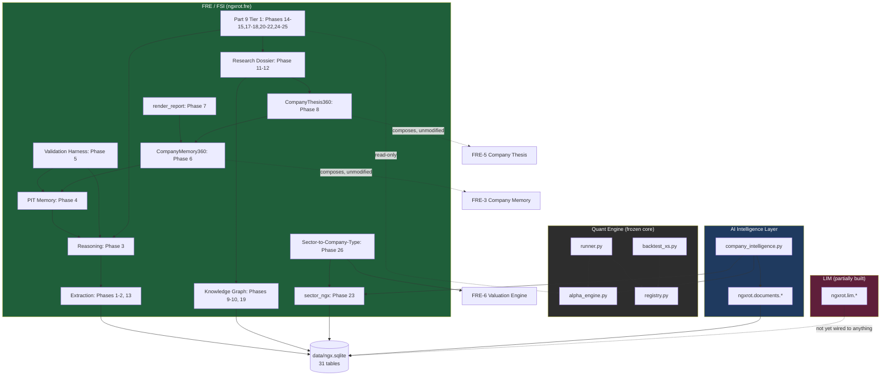

# Dependency Map — 2026-08-02 Stable Baseline

*Every subsystem and how it depends on, or is depended on by, every
other subsystem. Companion to `CONSOLIDATED_ARCHITECTURE_2026-08-02.md`.
An arrow (A → B) means "A reads from / calls / is built on top of B";
it never means the reverse can also happen unless stated. This is a
STRUCTURAL map (module/data dependencies), not a value/priority
ordering — see `FUTURE_EXPANSION_ROADMAP_2026-08-02.md` for that.*

## 1. Top-level system diagram

## 2. Per-subsystem dependency table

| Subsystem | Depends on (reads/imports) | Depended on by | Write path |
|---|---|---|---|
| `alpha_engine.py`, `runner.py`, `registry.py` (Quant Engine) | `db.py`, `backtest_xs.py`, `signal.py`, `universe.py` | `portfolio_memory.py` (read-only), `company_intelligence.py` (read-only) | Own experiment ledger (`registry.py`'s own SQLite tables) only |
| `ngxrot.documents.*` (AI Intelligence Layer) | `db.py`, `llm_providers.py`, `configs/llm_provider.toml` | `company_intelligence.py`; no FRE/FSI module imports this package | `documents`, `entities`, `entity_mentions`, `evidence`, `reasoning`, `investment_implications`, `causal_chain_steps`, `impact_assessments`, `effect_chains`, `research_task_candidates`, `self_critique_reviews`, `llm_calls` |
| `company_intelligence.py` | `alpha_engine.py` (read-only, `H011SizeAdapter`), `backtest_xs.py`, `universe.py`, `securities.sector_ngx` (Phase 27) | `scripts/company_profile.py` | None — read-only |
| FSI extraction (`fsi_extract_phase*.py` one-time scripts) | `documents`, `configs/financial_statement_terminology.toml` | `financial_ratios.py`, `trend_classification.py`, `financial_health_flags.py` (all read `extracted_facts`) | `extracted_facts` (append-only, one-time scripts, not standing tools) |
| `financial_ratios.py`, `trend_classification.py`, `financial_health_flags.py` (Phase 3) | `extracted_facts`, `period_normalization.py` | `pit_financial_memory.py`, `screening.py`, `sector_coverage.py` | `financial_reasoning_conclusions`, `financial_reasoning_conclusion_facts` (one-time compute scripts) |
| `pit_financial_memory.py` (Phase 4) | `financial_reasoning_conclusions`, `documents.filing_date` | `company_memory_360.py` | None |
| `pipeline_validation.py` (Phase 5) | Golden snapshot, Phases 3-4's own output | Run standalone (`fsi_phase5_validate_pipeline.py`) | None |
| `company_memory.py` (FRE-3) + `pit_financial_memory.py` | — | `company_memory_360.py` | None |
| `company_memory_360.py` (Phase 6) | `company_memory.py`, `pit_financial_memory.py` | `financial_reasoning_report.py`, `company_thesis_360.py`, `entity_context.py`, `company_research_dossier.py` | None |
| `financial_reasoning_report.py` (Phase 7) | `company_memory_360.py` | `company_research_dossier.py` (reused verbatim) | None |
| `company_thesis.py` (FRE-5) + `company_memory_360.py` | — | `company_thesis_360.py` | None |
| `company_thesis_360.py` (Phase 8) | `company_thesis.py`, `company_memory_360.py` | `company_research_dossier.py` | None |
| `entity_context.py` (Phase 10) | `entities`, `entity_relationships` (Phase 9), `company_memory_360.py` | `company_research_dossier.py`, `correlation_notes.py` | None |
| `correlation_notes.py` (Phase 19) | `entity_context.get_entity_context()` | Nothing yet (no CLI — data too thin to justify one) | None |
| `company_research_dossier.py` (Phase 11) | `company_thesis_360.py`, `entity_context.py`, `financial_reasoning_report.render_report()` (verbatim reuse) | `company_portfolio_context.py`, `scripts/fre/generate_research_dossier.py` | None |
| `screening.py` (Phase 14) | `financial_ratios.list_tickers()`, `pit_financial_memory.as_of()` | `scripts/fre/screen_companies.py` | None |
| `portfolio_memory.py` (Phase 17) | `alpha_engine.AlphaEngine().recommendations()` (read-only) | `company_portfolio_context.py` | None |
| `watchlist.py` (Phase 18) | `company_thesis_360.as_of()` (validates pointer), `watchlist_entries` table | `company_portfolio_context.py`, `sector_coverage.py`, `scripts/fre/manage_watchlist.py` | `watchlist_entries` (append-only) |
| `company_portfolio_context.py` (Phase 20) | `company_research_dossier.py`, `watchlist.list_active()`, `portfolio_memory.cross_reference()` | `scripts/fre/generate_portfolio_context_dossier.py` | None |
| `sector_ngx_provenance` + `securities.sector_ngx` (Phase 23) | NGX's own official Daily Official List (external, one-time population script) | `sector_coverage.py`, `sector_company_type_mapping.py`, `company_intelligence.py` | `sector_ngx_provenance` (append-only, one-time script) |
| `sector_coverage.py` (Phase 24) | `securities.sector_ngx`, `financial_ratios.list_tickers()`, `watchlist.list_active()` | `scripts/fre/screen_sector_coverage.py` | None |
| `sector_company_type_mapping.py` (Phase 26) | `securities.sector_ngx`, `sector_ngx_provenance.sub_industry`, `configs/sector_company_type_mapping.toml` | `valuation_engine.classify_company_type()` | None |
| `valuation_engine.py` (FRE-6, Phase 26) | `sector_company_type_mapping.py`, `configs/valuation_method_eligibility.toml`, `configs/company_type_overrides.toml`, `extracted_facts` | Nothing (terminal — `compute()` always refuses) | None |
| `ngxrot.lim.*` | `db.py` (its own eval/training tables) | Nothing yet — no caller wires LIM output into any FRE/FSI/AI-Layer consumer | Own `lim_*`-prefixed tables |

## 3. Cross-cutting dependencies (not module-to-module, but load-bearing)

- **Every FSI composition module depends transitively on the 10-ticker
  extraction roster** (Phases 1-2, 13) — this is the platform's single
  narrowest real bottleneck: everything from Screening to the
  Portfolio-Context Dossier only has real data to show for these 10
  tickers, though every module itself is written to work for any
  ticker the moment real facts exist for it.
- **Every Part 9 Tier-1 module depends on `alpha_engine.py` being
  read-only-reachable** — if that boundary is ever crossed (even by a
  future phase), every downstream Tier-1 guardrail this program
  enforced becomes meaningless. This is the platform's single most
  load-bearing invariant.
- **`sector_ngx`'s two real consumers (Phases 26, 27) are independent
  of each other** — `valuation_engine.py` and `company_intelligence.py`
  do not import each other and never will (per `valuation_engine.py`'s
  own architectural-isolation docstring, mechanically checked in
  `test_valuation_engine.py`).
- **The Quant Engine and the AI Intelligence Layer/FRE/FSI stack are
  connected in exactly one direction**: FRE/FSI/Company Intelligence
  read the Quant Engine's live sleeve; nothing in the Quant Engine
  reads anything from FRE/FSI/AI Intelligence Layer. This is verified
  mechanically (AST import checks) in every phase that touches this
  boundary, not just asserted in prose.
